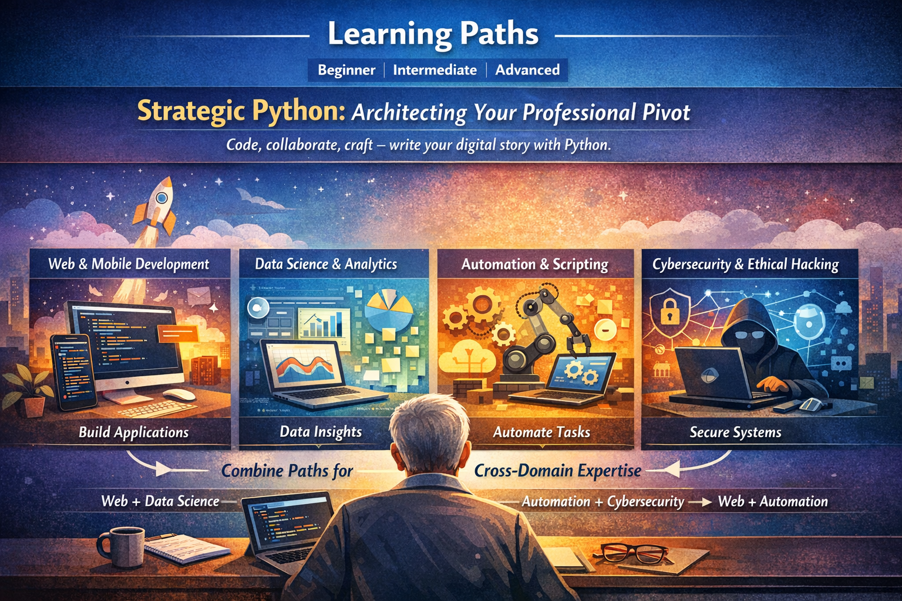
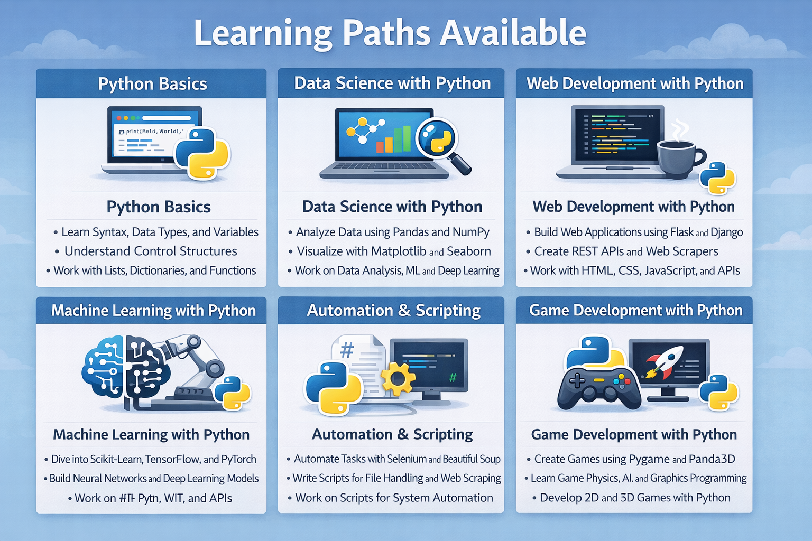

# Resources

This folder contains essential reference materials, templates, and visual assets to support Retiree Corporation initiatives, training, learning, and organizational knowledge sharing.

# Resources

This section contains **handouts, decks, tools, and images** for members.

---

## Documents

Slides, word documents, slides, spreadsheets used in this repo.

- [Retiree Corporation Handout](Retiree_Corporation_Handout.docx)
- [Retreat Values Deck](Retreat_Values_Deck.pptx)
- [Tools & Resources Library](Tools\ &\ Resources\ Library\ for\ Trainers,\ Developers,\ and\ Consultants.md)
- [Values and Operating Charter](Values_and_Operating_Charter.pptx)

---

## Images

Images used in this repo.

- 
- 

---

## Notes

- Ensure all presentation decks are reviewed for updated content before dissemination.
- Documents and images are maintained to reflect the latest organizational practices and values.
- New resources should be added to this folder with a brief description for easy reference.

## Usage

- Asoociates and Partners can use the `Tools & Resources Library` for planning workshops and service delivery.
- The handout and decks are intended for  events and service delivery.
- Infographics in `images/` can be used in presentations, internal portals, or learning platforms.

---

[⬅ Back to Retiree_Corp](../README.md)